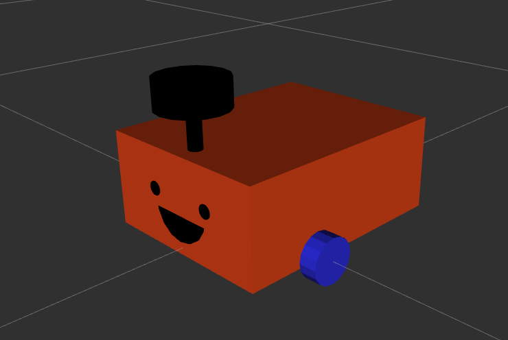

# Multi-Sensor Fusion for Enhanced Navigation

Final Year Individual Project Repository by Xinyang Huang

## Table of Contents
- [Introduction](#introduction)
- [Project Report](#project-report)
  - [Report in PDF](#report-in-pdf)
  - [Original LaTeX](#original-latex)
- [Code](#code)
  - [depth_image_to_laserscan](#depth_image_to_laserscan)
  - [robot_urdf](#robot)
  - [multi_sensor_fusion](#multi_sensor_fusion)
- [Test Results](#test-results)
- [Future Work](#future-work)

## Introduction
This repository contains all the necessary code, documentation, and additional resources for the "Multi-Sensor Fusion for Enhanced Navigation" project. The project aims to improve robotic navigation capabilities by integrating data from multiple sensors to overcome the limitations of individual sensor systems.

## Project Report
### Report in PDF
Find the comprehensive project report in PDF format [here](link-to-pdf).

### Original LaTeX
Access the LaTeX source files used to generate the project report [here](link-to-latex).

## Code
This section includes all the source code developed for the project, organized into specific modules:
### depthimage_to_laserscan
Code for converting depth images to laser scan data, enhancing obstacle detection in 2D navigation systems. [More info](link-to-code)

### robot
Implementation of the robotic control algorithms including navigation and sensor integration. [More info](link-to-code)

### multi_sensor_fusion
Core algorithms for the fusion of multiple sensor data aimed at providing accurate real-time localization and mapping. [More info](link-to-code)

## Test Results
Documentation of testing procedures, results, and how they validate the effectiveness of the proposed solutions. [View results](link-to-results)

## Future Work
Outline of potential future extensions and improvements to the project, based on current outcomes and technological advancements. [Read more](link-to-future-work)

- Test on real robots.
- Use multiple rows in depth image rather than one row.
- Use multiple cameras to achieve 360 degree detection.

---
For more information or inquiries, please contact [Xinyang Huang](xinyang.huang.21@ucl.ac.uk).
